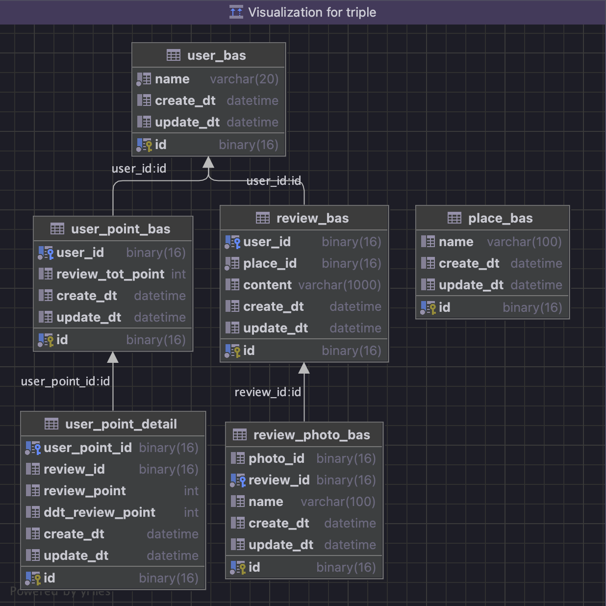

# Triple Traveler Club Mileage Service

### 목적
트리플 사용자들이 장소에 리뷰를 작성할 때 포인트를 부여하고, 전체/개인에 대한 포인트 부여 히스토리 와 개인별 누적포인트를 관리 하고자 합니다.   

### 개발 요구사항
1. 한 사용자는 장소마다 리뷰를 1개만 작성 할 수 있고,리뷰는 수정 또는 삭제 할 수 있습니다.
2. 리뷰는 수정 또는 삭제 할 수 있습니다
3. 포인트 증감이 있을때마다 이력이남아야합니다.  
4. 사용자마다 현재 시점의 포인트 총점을 조회하거나 계산 할 수 있어야 합니다.  
5. 포인트부여 API 구현에 필요한 SQL 수행시,전체테이블스캔이일어나지않는인덱스가필요합니다. 
6. 리뷰를 작성했다가 삭제하면 해당리뷰로 부여한 내용점수 와 보너스점수는 회수합니다. 
7. 리뷰를 수정하면 수정한 내용에 맞는 내용점수를 계산하여 점수를 부여하거나회수합니다.  
8. 글만 작성한 리뷰에 사진을 추가하면 1점을 부여합니다.  
9. 글 과 사진이 있는 리뷰에서 사진을 모두 삭제하면 1점을 회수합니다. 
10. 사용자 입장에서 본 '첫리뷰'일때 보너스점수를 부여합니다.  
11. 어떤 장소에 사용자A가 리뷰를 남겼다가 삭제하고,삭제된 이후 사용자B가 리뷰를 남기면 사용자 B에게 보너스점수를 부여합니다. 
12. 어떤 장소에 사용자A가 리뷰를 남겼다가삭제하는데,삭제되기 이전 사용자B가 리뷰를 남기면 사용자B에게 보너스점수를 부여하지않습니다.
13. 리뷰 작성 보상 점수 
    1. 내용 점수
       1. 1자 이상 텍스트 작성 : 1점
       2. 1장 이상 사진 첨부 : 1점
    2. 보너스 점수
       1. 특정 장소에 첫 리뷰 작성 : 1점

### API 요청 양식
```
POST/events  
{
    "type":"REVIEW",  
    "action":"ADD",/*"MOD","DELETE"*/  
    "reviewId":"240a0658-dc5f-4878-9381-ebb7b2667772",  
    "content":"좋아요!",  
    "attachedPhotoIds":["e4d1a64e-a531-46de-88d0-ff0ed70c0bb8","afb0cef2-851d-4a50-bb07-9cc15cbdc332"],  
    "userId":"3ede0ef2-92b7-4817-a5f3-0c575361f745",  
    "placeId":"2e4baf1c-5acb-4efb-a1af-eddada31b00f"  
}

type: 미리정의된string값을가지고있습니다.리뷰이벤트의경우"REVIEW"로옵니다.  
action: 리뷰생성이벤트의경우"ADD", 수정이벤트는"MOD", 삭제이벤트는"DELETE"값을가지고있습니다.  
reviewId: UUID포맷의reviewid입니다.어떤리뷰에대한이벤트인지가리키는값입니다.  
content: 리뷰의내용입니다.  
attachedPhotoIds: 리뷰에첨부된이미지들의id배열입니다.  
userId: 리뷰의작성자id입니다.  
placeId: 리뷰가작성된장소의id입니다.  
```

### 백엔드 서비스 구성
- Framework : Springboot2.5.3
- Language : Java11
- DB : Mysql (Ver 8.0.26 for Linux on x86_64 (MySQL Community Server - GPL))

### 테이블 설계
  

### 어플리케이션 실행 방법
- Mysql docker 설치 및 실행
  - ```파일 위치 : src/main/resources/docker/docker-compose.yml```
  - ```실행 명령어 : docker-compose up -d```
- Springboot 실행
  - ```gradle build : ./gradlew build -x test```
  - ```cd /Users/seunghapark/dev_local_/_projects/triple/build/libs```
  - ```java -jar triple-0.0.1-SNAPSHOT.jar```

### 사전 데이터 등록
```
insert into user_bas (id, name, create_dt, update_dt)
values (uuid_to_bin('9e1094b5-f31c-4118-82fa-5020da938b7d'), 'TestUser', now(), now())
;

insert into place_bas (id, name, create_dt, update_dt)
values (uuid_to_bin('ac86b84a-212b-4797-9753-513a8493809c'), 'Place01', now(), now())
;
commit;
```
### 서비스 테스트 방법
###### 리뷰 등록 테스트
- Request
```
POST http://localhost:3000/events
{
    "type":"REVIEW",
    "action":"ADD",
    "reviewId":"92dd8f6c-25ef-46ff-944b-4401ecd09e28",
    "userId":"1e44fa8e-13b4-490f-ba00-c6a834dbe386",
    "placeId":"6c20dbf8-40a9-4dd0-bdab-ac490e960e43",
    "attachedPhotoIds":["bc1735d7-c18c-4eee-96a6-74349739a7fc", "bc1735d7-c18c-4eee-96a6-74349739a8fc"],
    "content":""
}
```
- Response
```
{
    "httpStatus": "CREATED",
    "data": [
        "CREATED_RIVEW"
    ]
}
```
###### 리뷰 수정 테스트
- Request
```
POST http://localhost:3000/events
{
    "type":"REVIEW",
    "action":"MOD",
    "reviewId":"92dd8f6c-25ef-46ff-944b-4401ecd09e28",
    "userId":"1e44fa8e-13b4-490f-ba00-c6a834dbe386",
    "placeId":"6c20dbf8-40a9-4dd0-bdab-ac490e960e43",
    "attachedPhotoIds":[],
    "content":""
}
```
- Response
```
{
    "httpStatus": "OK",
    "data": [
        "UPDATED"
    ]
}
```
##### 리뷰 삭제
- Request
```
POST http://localhost:3000/events
{
    "type":"REVIEW",
    "action":"DELETE",
    "action":"DELETE",
    "reviewId":"92dd8f6c-25ef-46ff-944b-4401ecd09e28",
    "userId":"1e44fa8e-13b4-490f-ba00-c6a834dbe386",
    "placeId":"6c20dbf8-40a9-4dd0-bdab-ac490e960e43",
    "attachedPhotoIds":[],
    "content":""
}
```
- Response
```
{
    "httpStatus": "OK",
    "data": [
        "DELETED"
    ]
}
```
###### 사용자 리뷰 포인트 조회
- Request
```
GET http://localhost:3000/point
{
    "userId":"1e44fa8e-13b4-490f-ba00-c6a834dbe386"
}
```
- Response
```
{
    "httpStatus": "OK",
    "data": [
        {
            "user-name": "lee",
            "user-id": "1e44fa8e-13b4-490f-ba00-c6a834dbe386",
            "user-point": 0
        }
    ]
}
```
